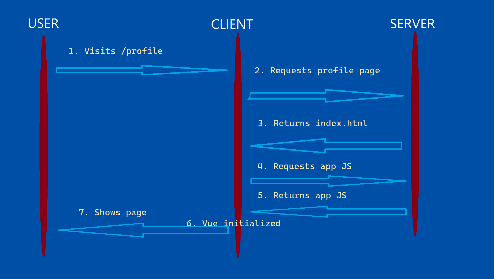

---
prev:
    text: Problems with Vue
    link: /nuxt/vue-problems
next:
    text: Project Initialization
    link: /nuxt/project-init
---
## Rendering modes

Nuxt Universal Mode aims to reap the benefits of single page apps and server-side rendering.

[Vue SSR Guide](https://ssr.vuejs.org/)

### Normal web page behaviour
Client requests /profile. Server returns profile.html.

### Single-page application behaviour
Server returns index.html and Javascript. Vue is initialized on the client. Vue router
shows the exact requested page and components on the client. API calls are also
made from tbe client. Once this done, templates are rendered and the page is shown.

Initial load gets slower as the project grows. UI is fast once loaded.

### Universal mode
Server renders .vue to HTML for the specific page.
The rendered template is displayed to the user before Vue is initialized.
Javascript is then fetched and loaded on the client.
Vue is initialized and hydrates the template, making it interactive and reactive.
App behaves like an SPA hereafter.
Server doesn't render all templates upfront.
Page-specific Javascript is fetched where needed.

Faster initial load, SPA-behaviour on later loads.

### Universal Mode Pros and Cons

|          Pros          |                   Cons                  |
|:----------------------:|:---------------------------------------:|
| Improved SEO           | Browser vs server implementation        |
| Faster time-to-content | More involved setup and deployment-wise |
|                        | More server-side load                   |

[Full Nuxt lifecycle](https://nuxtjs.org/docs/concepts/nuxt-lifecycle)